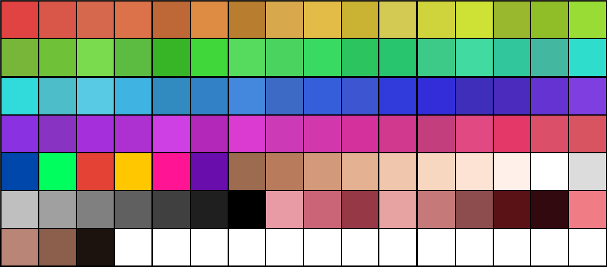

# MGA — Art Direction

---

## Visual Style

MGA uses an anime/manga aesthetic throughout. Meshes are authored to anime conventions — clean topology, stylised proportions, and geometry that reads well under cel shading. The rendering pipeline is built to reinforce this style at every layer: palette-controlled colour, banded lighting, and drawn outlines, all without relying on post-processing.

**Style reference:** Modern Anime Stylized — the visual sub-category occupied by Genshin Impact, Blue Protocol, and Honkai Star Rail. Smooth chunky hair clumps, rhythmic curves, clean silhouette shapes, soft but structured forms, medium detail, physics-friendly geometry.

**Guiding principle:** The look is achieved in the render pass, not after it. Post-processing is avoided where a geometry or shader solution exists. This keeps overhead low and the frame budget predictable.

*See [Character Pipeline](character-pipeline.md) for body mesh architecture, hair system, and clothing workflow.*

---

## Cel Shader — 2-Tone Banded Lighting

Lighting uses a 2-tone cel shader. Diffuse contribution from the primary light source is evaluated against each surface normal and quantised into two discrete bands rather than a smooth gradient.

| Band | Role |
|------|------|
| Lit | The character's intended read colour under primary light |
| Shadow | The cooler/darker step where the primary light fails to reach the surface |

The split is determined by the angle between the surface normal and the primary light direction, against a single threshold per material. The threshold is tunable per material to allow different materials (skin, fabric, metal) to respond differently to the same light, but the rendered output is always two tones — not three, not four.

**Why two and not four.** A 2-band shader makes the shadow shape the *only* meaningful sculpting variable, which is exactly the variable an artist wants to control deliberately. Adding additional bands introduces extra thresholds that compound across geometry in ways that don't always cooperate with the shape language. The 2-band model is the de facto standard for modern stylised cel-shaded titles (*Genshin Impact*, *Honkai*, *Persona*, *Guilty Gear Strive*) for exactly this reason; 3+ band approaches read closer to hand-painted 2D cel work, which doesn't fit a real-time PBR-meets-cel pipeline.

### Specular highlight — separate pass

Specular contribution is handled outside the diffuse banding as its own pass. A stepped specular evaluates the half-vector against the surface normal and emits a flat anime-style highlight — typically one bright zone, optionally a second falloff zone, with a hard edge. The specular intensity is driven by MOHW.B (highlight band intensity) per [material instance](#material-instance-parameters). Specular threshold is tunable per material.

This separation lets a character's diffuse shadow be sculpted independently of their highlight placement — the highlight follows the light direction; the shadow follows the surface curvature; they don't compete for the same threshold.

### Rim light — separate pass

A fresnel-based rim light is layered on as a third pass — a stepped anime-style rim that emphasises the silhouette against the background. Rim intensity, colour, and threshold are tunable per material. The rim and the inverse-hull outline serve different purposes: the outline is a hard silhouette read; the rim is a lighting cue that gives the form volume against its environment.

### Summary

The full lighting stack at a glance:

| Pass | Contribution | Threshold count | Tunable |
|------|--------------|-----------------|---------|
| Diffuse (2-tone band) | Lit / Shadow | 1 | Per material |
| Specular highlight | Stepped anime highlight | 1 (optionally 2 for falloff) | Per material |
| Rim light | Stepped fresnel rim | 1 | Per material |
| Inverse-hull outline | Silhouette stroke | n/a | Per master (Architecture / Character / etc.) |

### Implementation — UE 5.8 Toon BSDF (Substrate) *(target; migrating off the hand-built passes)*

The passes above define the **look**. As of **UE 5.8**, the **implementation** moves to native Substrate nodes, replacing the hand-built shading network. The material is structured **front-end / back-end**:

- **Front-end (unchanged) — base colour.** The palette / Primary-texture selection: `MF_UVsToParameters` + `MF_SelectColorFromPalette` resolve the zone selectors and mix into the surface base colour, and unpack the SARE / MOHW / Definition parameters. (See [Colour Palette](#colour-palette).)
- **Back-end → Toon BSDF.** The new **Substrate Toon BSDF** node replaces the custom cel network. The 2-tone diffuse band (and, pending confirmation, the stepped specular and rim) are configured by a **Toon Profile asset** bound to the BSDF, rather than three separate hand-built passes. The front-end base colour and channel params feed the BSDF's inputs.
- **Emission → Unlit BSDF.** The emission boost (SARE.A) is carried by a **Substrate Unlit BSDF** node.
- **Combine.** The Toon BSDF and the Unlit BSDF are summed via a **Substrate Add** node for the final output.
- **Outline unchanged.** The inverse-hull outline stays a separate **geometry** pass — not part of the BSDF back-end.
- **Scope.** Cel masters only (Character, Hair, Eye, Cloth, Architecture, Foliage, Decal-when-toggled). The **non-cel** masters — **Ground, Water, Glass** — keep their existing Substrate BSDFs and do **not** use the Toon BSDF.

**To confirm in-editor at 5.8 adoption:** whether the Toon Profile subsumes all of diffuse-band / specular / rim (likely) or only the diffuse band; the exact mapping of SARE (SSS/AO/Roughness) and MOHW (Metallic/Outline-weight/Highlight/Wetness) onto Toon BSDF inputs vs. Toon Profile settings; Toon Profile asset naming (proposal `TP_<Family>` — `TP_Character`, `TP_Cloth`, …).

---

## Colour Palette

All colour in the game is drawn from a **98-entry palette** stored as a 16×7 grid (with unused slots in the final row). No material uses colour values outside the palette.

| Category | Count | Purpose |
|----------|-------|---------|
| Base chromatic | 64 | Full hue spectrum — clothing, environment, props, effects, secondary colours (rows 1–4) |
| Signature colours | 6 | Reserved identity colours for key characters (see story spoiler below) |
| Flesh tones | 8 | Skin across the full character roster |
| Greyscale | 8 | Shadows, metals, neutral elements, UI |
| Blush tones | 12 | Anime blush, flush, lips, mouth interior, and emotional colour states |
| **Total** | **98** | |

⚠️ Story Spoiler — Signature Colours

The 6 signature colours are reserved for the five magical girls and Tierney. Only these characters use these colours.

**Palette intent:** The palette is intentionally bright and cheerful. This is a deliberate choice on two levels. Technically, saturated and well-separated colours are easier to work with under cel shading — banding reads cleanly, zones are distinct, and the two lighting tones produce legible results without muddy mid-values. With only two diffuse tones to do the visual work, each colour's lit and shadow values need to be well-separated; the saturated palette buys that separation for free. Thematically, the brightness creates an emotional counterbalance to the dystopian society operating on Terridyn. The world is corporate-controlled, half-empty, and quietly dangerous; the visual language refuses to reflect that darkness back at the player. The game looks like a place where good things can happen, because they can. This tonal balance is established from the first frame and holds consistently — so that when characters like Sir Gallopington arrive, they feel native to the world rather than tonally incongruous.

**Palette discipline:** The restricted palette enforces visual consistency across the game. Characters, environments, and UI all speak the same colour language. New assets that require a new colour require a palette discussion — the palette is not expanded casually.

**Blush tones** are designed to blend with flesh tones through the material B channel (see below), creating the anime blush effect as a material parameter rather than a separate render pass.

**Signature colours** correspond to the key characters and factions whose colours appear repeatedly across costume, UI, and environmental storytelling.

---

## Material System — Double-Index Palette

Textures in MGA are not used as direct colour maps. Instead they act as a double index into the palette, with colour selection and blending controlled per material instance. This separates the authored mesh from its colour — a single asset can be recoloured entirely by changing material instance parameters, with no texture repaint required.

### Material Instance Parameters

Each material instance exposes two arrays of palette index slots:

| Parameter | Count | Maps to |
|-----------|-------|---------|
| Color 1 indexes | 30 | Palette entries (1–98) |
| Color 2 indexes | 30 | Palette entries (1–98) |

The 30 Color 1 slots and 30 Color 2 slots define the colour vocabulary available to that material instance. Which slot applies to any given pixel is determined by the primary texture.

### Primary Texture — RGBA

| Channel | Role |
|---------|------|
| **R** | Selects which Color 1 slot (1–N) applies to this pixel region |
| **G** | Selects which Color 2 slot (1–N) applies to this pixel region |
| **B** | Mix ratio — lerp between the selected Color 1 and Color 2 |
| **A** | Alpha |

The R and G channels divide the mesh surface into up to N independently addressable colour zones each, where **N is the master's `MaxIndex`** parameter (default 30, set per-master to match the texture's authored zone count). Selector math is `Round(channel × MaxIndex)` clamped to `[1, MaxIndex]`, so R and G must be authored in `1/N` steps — e.g. R ∈ {1/2, 2/2} for a 2-zone master, R ∈ {1/30, …, 30/30} for a 30-zone master. The B channel blends between the two selected palette entries, allowing two-tone materials: a fabric with warp and weft colours, skin with a blush layer, hair with a highlight band. Changing the look of any zone is a material instance parameter edit, not a texture repaint.

### SARE Texture — Surface Properties

A second texture carries surface property data in packed channels (acronym from its channel allocation):

| Channel | Role |
|---------|------|
| **R** | **S**ubsurface scattering mask / intensity |
| **G** | **A**mbient occlusion |
| **B** | **R**oughness |
| **A** | **E**mission boost |

This texture is authored once per mesh and does not change with colour variations. Subsurface scattering on the R channel is the primary driver of skin warmth and the soft look of flesh in lit areas.

### MOHW Texture — Extended Surface Properties

A third texture carries additional surface and rendering parameters that don't fit in the SARE's four channels (acronym from its channel allocation):

| Channel | Role |
|---------|------|
| **R** | **M**etallic |
| **G** | **O**utline weight modulator (per-pixel inverse-hull thickness multiplier) |
| **B** | **H**ighlight band intensity (anisotropic-style highlight strength on hair, metal, glossy surfaces) |
| **A** | **W**etness mask (drives wet-surface roughness blend for rain / puddle states) |

The MOHW is authored on the same UV layout as the Primary and SARE (UV0). Like the SARE, it does not change with colour variations.

**Channel authoring rules:**

- **R (Metallic):** Paint solid regions at exactly 0 (dielectric) or exactly 1 (pure metal). Intermediate values are permitted only at transition pixels — chipped paint over bare metal, tarnish/oxidation gradients, mipmap-filtered edges. Do not author large areas at intermediate values; the result is physically meaningless and reads muddy.
- **B (Highlight band intensity):** Continuous 0–1. This is the correct channel for stylised "shiny but not metal" effects (varnished wood, polished plastic, wet skin) — do not abuse Metallic for these.
- **G (Outline weight modulator):** Continuous 0–1, multiplied against the master's base outline weight.
- **A (Wetness mask):** Continuous 0–1, drives the wet-surface roughness blend.

### Definition Texture — In-Line Detail

A fourth texture is applied on the UV1 channel (beta UV), independent of the primary UV layout. Its role is interior line definition: the fold lines, anatomical detail, fabric seams, and crease marks that give the anime aesthetic its drawn quality.

Because beta UV is independent, definition lines can be positioned and scaled separately from the diffuse mapping. This texture does not interact with the palette system — it carries drawn line data directly.

---

## Outlines

Character and object silhouettes use the **inverse hull** technique: a second render of the mesh at a slightly increased scale, with inverted normals, drawn in the outline colour. The front faces of the hull are culled; only the rim beyond the original silhouette is visible.

**Why inverse hull over post-process edge detection:**
Post-processing approaches for outlines (Sobel edge detection, depth/normal edge passes) introduce overhead that scales with resolution and scene complexity. Inverse hull is a geometry solution — its cost is proportional to mesh complexity, predictable, and keeps the outline entirely within the render pass. Post-processing is not used for outlines.

Interior lines — anatomy, clothing folds, seam detail — are handled by the definition texture and beta UV, not by any outline pass. The combination of inverse hull silhouette and definition texture interior lines produces the full anime line aesthetic without post-process cost.

**Outline colour and weight** are material parameters, allowing different outline treatments per character, costume, or environmental asset class.

---

## Asset Pipeline Summary

| Asset type | Textures | Notes |
|------------|----------|-------|
| Character mesh | Primary (RGBA) + SARE (RGBA) + MOHW (RGBA) + Definition (beta UV) | 4 textures per mesh; colour via material instance |
| Costume variant | Material instance only | No additional texture if zones match existing mesh |
| Environment asset | Primary + SARE + MOHW; Definition where needed | Same system; fewer colour zones typically required |

**The key efficiency:** colour variation is a material instance change. A costume in a different colour, an NPC skin tone variant, a faction-coloured prop — none of these require new textures. The palette and the double-index system make variation cheap.

---

## Asset Sourcing and Workflow

MGA does not model every asset from scratch. The practical workflow uses existing 3D assets as a starting point, replacing their materials and textures to bring them into the visual system.

### Asset Sources

- **Humble Bundle purchases** — commercial 3D assets acquired through bundle deals
- **Epic Games Store free assets** — assets distributed free through the Unreal Engine marketplace

These assets arrive with their own materials and textures, which are discarded. Only the geometry is retained.

### Conversion Process

1. **Import** — Asset imported into Unreal Engine with Nanite compatibility enabled as a standard step
2. **Material replacement** — Original materials stripped; custom double-index palette material applied
3. **Texture authoring** — Primary RGBA, SARE surface-properties RGBA, MOHW extended-properties RGBA, and Definition (where needed) authored for the mesh, with Definition on the UV1 beta layout
4. **Palette assignment** — Material instance parameters set to assign the appropriate Color 1 and Color 2 palette slots for the asset's role and context

The result is an asset that looks native to MGA's visual language despite not being modelled for it. The palette discipline enforces visual consistency: an asset is only finished when it speaks the same colour vocabulary as the rest of the game.

### Why This Works

The anime/manga aesthetic is achieved at the material and shader layer, not the modelling layer. A mesh with correct topology reads correctly under the cel shader and inverse hull outline regardless of where it originated. The primary constraint is that the geometry is clean enough to outline well — heavily triangulated or noisy meshes may require cleanup before the inverse hull solution reads cleanly.

---

## Related

- [TB-materials](../technical-briefs/TB-materials.md) — master material list, instance naming patterns, hierarchy rules

## Open Items

- Inverse hull weight / scaling values — to be calibrated during shader development
- Whether the diffuse shadow-band, specular, and rim thresholds are globally uniform or exposed as per-material parameters (lean: per-material — the whole point of the separate-pass model is independent control)
- Signature colour assignments — partially established through character identity; to be formally locked into the palette
- ~~Environment palette usage~~ — RESOLVED: ground (`M_Master_Ground`) uses the full palette to enable debug-bounds visualisation; environmental discipline is editorial. See [TB-materials](../technical-briefs/TB-materials.md).
- Whether the definition texture uses a fixed line colour or samples from the palette
