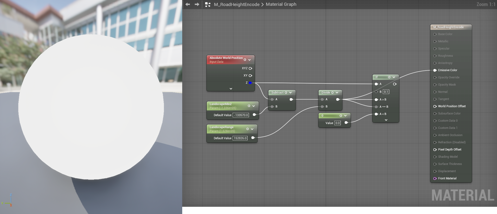

# TB — Road Conformity Landscape Brush

## Overview

Roads are authored by placing static meshes at heights sampled from the landscape under each spline point. When the landscape is later sculpted, or when roads are moved/replaced, the two drift out of alignment — terrain pokes through asphalt, gaps appear under bridge abutments, sidewalk seams float. Even subtle mismatches cause PCG tooling to misinterpret the situation: a few cm of terrain above road level reads as "needs a bridge" to the building generator.

This brief defines a procedural landscape modifier that pulls the terrain back into alignment with the current state of the road network, on demand. The implementation is a Landscape Blueprint Brush that uses a Scene Capture 2D to read road mesh heights from the live scene, then blends those into a dedicated Landscape Edit Layer. It runs only on manual refresh, leaves all other landscape sculpting untouched, and naturally respects World Partition streaming.

This is the implementation of "Option C" from the design discussion that produced this brief. Earlier options considered: Landscape Splines (rejected — fights the spline system at the scale of a 16km road network) and a pre-baked heightmap PNG (rejected — 16k × 16k texture is unwieldy, and roads change too often for a bake to stay current).

---

## Architecture

```
RoadGeo actors in the level (subclass of WorldBLDGeo)
        │
        │ (per-actor material override — M_RoadHeightEncode applied to all StaticMeshComponents
        │  during the SceneCapture pass, then restored after)
        ▼
[SceneCaptureComponent2D, top-down ortho, ShowOnly filtered]
        │
        │ (M_RoadHeightEncode:
        │  outputs (Z − LandscapeMinZ) / LandscapeRange as a normalized 0..1 in R32F)
        ▼
[RT_RoadHeights] (R32F, 4096²)   ← cached, only refreshed on Refresh Roads
        │
[BP_RoadConformityBrush.Render Layer()]
        │ (M_LandscapeBrush_RoadConformity:
        │  decodes existing landscape height, samples RT_RoadHeights with masked dilation,
        │  applies high-pass threshold, blends, encodes 16-bit packed RG output)
        ▼
[Roads Edit Layer on the Landscape]
        │
        ▼
[Final landscape heights conform to road meshes]
```

The expensive step is the SceneCapture. It runs only when the user clicks **Refresh Roads** on the brush. Render Layer is a per-chunk per-pixel material that's cheap by comparison and can be invoked freely by the engine.

### Why per-actor material override instead of post-process encode

Substrate (UE 5.7's new shading system, on by default in this project) changes how post-process materials behave for SceneCapture writes. The legacy "post-process material → encode WorldPosition.Z" pipeline produces clamped LDR outputs even with HDR capture sources, breaking the float encoding.

The workaround is to apply the encode material **directly as a per-actor override** on each road mesh component for the duration of the capture, then restore the originals. Each road's pixels emit the normalized Z value from their own material output (not from a post-process resolve), which avoids Substrate's resolve pipeline entirely.

---

## Pieces

| Asset | Type | Path | Purpose |
|---|---|---|---|
| `BP_RoadConformityBrush` | Blueprint Class (parent: `LandscapeBlueprintBrush`) | `Content/MGA/Blueprints/World/` | The brush itself. Hosts the SceneCapture, refresh logic, and Render Layer override. |
| `RT_RoadHeights` | Texture Render Target 2D, R32F, 4096² | `Content/MGA/Materials/Shared/Brushes/` | Cached road heightmap, normalized 0..1 encoding |
| `M_RoadHeightEncode` | Material, Surface domain, Substrate slab, Opaque | `Content/MGA/Materials/Shared/Brushes/` | Per-actor override during SceneCapture. Outputs `(Z − LandscapeMinZ) / LandscapeRange` to Emissive |
| `M_LandscapeBrush_RoadConformity` | Material, Surface domain | `Content/MGA/Materials/Shared/Brushes/` | Brush working material. Decode-blend-encode chain with masked dilation and high-pass threshold |

---

## Landscape configuration (one-time)

In UE 5.7, all landscapes use the edit-layer system by default — non-edit-layer landscapes are deprecated and the explicit "Enable Edit Layers" checkbox no longer exists. Edit Layers is simply on.

1. Open **Landscape Mode → Manage tab** and locate the **Edit Layers** panel.
2. Add an edit layer named `Roads`. Position it above your `Base` sculpting layer in the stack.
3. Add the brush to the layer: select the `Roads` layer in the panel, right-click the layer row → **Add Blueprint Brush** → pick `BP_RoadConformityBrush`. The actor gets placed in the world and registered against the layer in one step. (Dragging the BP into the viewport does not work for landscape brushes in 5.3+.)

**Critical brush class property:** in the brush BP's Class Defaults, set **`Affects Heightmap = true`**. The base class `LandscapeBlueprintBrushBase` defaults this to false, which makes the brush invisible to the heightmap layer picker. Leave `Affects Weightmap` and `Affects Visibility Layer` off.

---

## Calibration constants

The brush's UV math depends on a small set of constants derived from the landscape's dimensions. Values shown for the current MGA test landscape (8129 × 8129 vertices, 198.45 cm/vert, located at world (−806500.788, −806500.788)).

| Constant | Value | Where used |
|---|---|---|
| `LandscapeMinZ` | `−133570` cm | M_RoadHeightEncode — Z normalization |
| `LandscapeRange` | `152826` cm | M_RoadHeightEncode — Z normalization |
| `LandscapeMaxZ` | `+19256` cm | Reference only |
| `LandscapeMidZ` | `−57157.21` cm | LandscapeLocation.Z — landscape's origin Z |
| `OrthoWidth` | `1,613,200` cm | SceneCapture's full ortho extent |
| `CaptureCenterX/Y` | `100, 100` cm | SceneCapture world Location (approximates landscape center 99.21, 99.21) |
| `RenderAreaSize` | `8129 × 8129` | Heightmap vertex count per side (runtime from `InTransform`) |
| `LandscapeScale.X/Y` | `198.45` cm | Per-vertex spacing (runtime from `InTransform.Scale`) |
| `BrushSizeX_Fudge` | `1.00651` | Empirical X-axis calibration |
| `BrushSizeY_Fudge` | `1.0042`  | Empirical Y-axis calibration |
| `OffsetX` | `1200` cm | Constant XY shift to align ridge under road |
| `OffsetY` | `2800` cm | Constant XY shift to align ridge under road |
| `ZBias` | `−40` cm | Pushes conformed terrain just below road to prevent clipping |
| `HighPassThreshold` | `0.75` | Reject R_norm samples below this as AA edge bleed |
| `TexelSearchSize` | `1` (texel) | Masked dilation reach, knob in [0..4] |
| `MaxLandscapeBelow` | `429` (16-bit packed) | Sanity limit — reject conformity that drops > 10 m below natural terrain |

### Why the fudge factors

The brush's nominal math (`BrushSize = RenderAreaSize × Scale`, `OrthoWidth = LandscapeWidth`) is theoretically exact, but in practice produces ~0.5–0.65% scale drift between road geometry and conformity ridge. Root cause is likely a subtle SceneCapture-side difference between nominal OrthoWidth and effective rendered area at large world coordinates (sub-pixel precision in the projection matrix at ~±800k cm). Adjusted empirically to <0.05% residual after one iteration.

Constant `Offset` shifts are similarly empirical — they correct for sub-cell origin discrepancies that no constant we have access to predicts exactly.

---

## Blueprint — BP_RoadConformityBrush

### Variables

Column "Flags" lists Blueprint variable-details checkboxes: **IE** = Instance Editable, **BPRO** = Blueprint Read Only.

| Name | Type | Default | Flags | Notes |
|---|---|---|---|---|
| `SceneCapture` | `SceneCaptureComponent2D` | — | — | Added as a component |
| `RoadHeightsRT` | `TextureRenderTarget2D` | reference to `RT_RoadHeights` | IE | Cached heightmap |
| `WorkingRT` | `TextureRenderTarget2D` | null (lazily created) | IE | Per-call output, recreated when size mismatches |
| `RoadHeightEncodeMaterial` | `MaterialInterface` | `M_RoadHeightEncode` | IE | Applied as override during capture |
| `BlendMaterial` | `MaterialInterface` | `M_LandscapeBrush_RoadConformity` | IE | Per-chunk conformity material |
| `BlendMID` | `MaterialInstanceDynamic` | — | — | Built once in Construction Script |
| `RoadActorClass` | `TSubclassOf<Actor>` | `RoadGeo` (or `WorldBLDGeo`) | IE | Class filter for capture |
| `SavedMaterials` | `Array<MaterialInterface>` | — | — | Class variable used to restore originals after capture |
| `bHasCaptured` | bool | `false` | IE | Brush is no-op until first refresh |
| `LastRefreshTime` | DateTime | — | IE | Set by `RefreshRoads` |
| `LastCapturedActorCount` | int | `0` | IE | Set by `RefreshRoads` |
| `LandscapeMinZ`, `LandscapeRange` | Scalar param refs | per Calibration | IE | Propagated to M_RoadHeightEncode |
| `BrushSizeXFudge`, `BrushSizeYFudge` | Scalars | `1.00651`, `1.0042` | IE | Calibration multipliers |
| `OffsetX`, `OffsetY` | Scalars (cm) | `1200`, `2800` | IE | Constant XY corrections |
| `ZBias` | Scalar (cm) | `−40` | IE | Road clearance bias |

### Components

- `SceneCapture` (SceneCaptureComponent2D)
  - Projection Type: **Orthographic**
  - Capture Source: **Final Color (HDR) in Linear Working Color Space**
  - **Primitive Render Mode: `Use ShowOnly List`** (critical — default `Legacy Scene Capture` silently ignores ShowOnly filter)
  - Texture Target: `RoadHeightsRT`
  - Show-Only Actors: populated at refresh time
  - Capture every frame: **off**
  - Capture on movement: **off**
  - Composite Mode: **Overwrite**
  - **No Post-Process Material** — the encode is per-actor (see Architecture)
  - Show Flags: Tonemapper / Bloom / AutoExposure / AA all **off**
  - World Rotation: **Pitch=−90, Yaw=−90, Roll=0** (puts image right = world +X, image up = world +Y)
  - World Location: `(100, 100, 200000)` — XY = landscape center, Z = high above ground
  - OrthoWidth: `1,613,200` (covers full landscape)

### Construction Script

The MID for the blend material is created once on construction and stored in `BlendMID` so Render Layer can reuse it across calls instead of recreating per-call.


### Function: `RefreshRoads` (CallInEditor)

The function has four phases. The critical phase is the per-actor material override around `CaptureScene`.

```
RefreshRoads():
    // PHASE 1: gather actors + landscape transform
    actors = GetAllActorsOfClass(RoadActorClass)
    if actors is empty:
        Print "No road actors found"; return
    landscape = GetAllActorsOfClass(Landscape)[0]
    // Note: WP landscape master returns zero bounds via GetActorBounds — use known constants

    // PHASE 2: configure SceneCapture
    SceneCapture.ShowOnlyActors = actors
    SceneCapture.SetWorldLocation((100, 100, 200000))
    SceneCapture.SetWorldRotation(Rotator(Pitch=−90, Yaw=−90, Roll=0))
    SceneCapture.OrthoWidth = 1613200

    // PHASE 3: per-actor material override → CaptureScene → restore
    SavedMaterials.Clear()
    for actor in actors:
        components = actor.GetComponentsByClass(StaticMeshComponent)   // not ISMC!
        for comp in components:
            for slot in 0..comp.NumMaterials-1:
                SavedMaterials.Add(comp.GetMaterial(slot))               // save by SetMaterial API
                comp.SetMaterial(slot, RoadHeightEncodeMaterial)         // override

    SceneCapture.CaptureScene()                                        // expensive call

    saveIdx = 0
    for actor in actors:                                                // restore in same order
        components = actor.GetComponentsByClass(StaticMeshComponent)
        for comp in components:
            for slot in 0..comp.NumMaterials-1:
                comp.SetMaterial(slot, SavedMaterials[saveIdx])
                saveIdx++
    SavedMaterials.Clear()

    // PHASE 4: state + landscape update
    bHasCaptured = true
    LastRefreshTime = Now()
    LastCapturedActorCount = actors.Num()
    RequestLandscapeUpdate()
    Print "Refreshed: {actors.Num()} road actors"
```

Reference graph (implemented):


**Implementation gotchas learned the hard way:**

1. **Class filter must be `StaticMeshComponent`, not `InstancedStaticMeshComponent`.** RoadGeo's root mesh component is a plain SMC. The ISMC filter is more specific (ISMC inherits FROM SMC, not the other way), so an SMC filter catches both. An ISMC filter catches zero plain SMCs.

2. **Use `SetMaterial(slot, mat)`, not direct array writes.** Writing to `Override Materials` array doesn't trigger the render-thread invalidation that makes the override actually take effect. SetMaterial does.

3. **`SavedMaterials` must be a class variable, not function-local.** Function-local arrays in Blueprint can lose data due to by-value semantics on some operations. Class variable guarantees the array survives the loop boundary into CaptureScene and back.

4. **`bHasCaptured` checkbox on Set node defaults to false.** When you wire a Set node, the engine treats the checkbox as the value to assign — manually tick it for `bHasCaptured = true`. Subtle and easy to miss.

### Function: `ClearRoadDeformation` (CallInEditor)

```
ClearRoadDeformation():
    bHasCaptured = false
    RequestLandscapeUpdate()
```

### Override: `Render Layer`

In UE 5.7 the override is **`Render Layer`** (renamed from the older `Render` since edit layers are now mandatory). Takes a single struct input — `In Parameters` of type `Landscape Brush Parameters`. The implementation computes per-pixel WorldXY from the chunk's transform, packs MID parameters, and dispatches the blend material.

```
RenderLayer(InParameters) → TextureRenderTarget2D:
    Break InParameters → {RenderAreaWorldTransform, RenderAreaSize,
                          CombinedResult, LayerType, WeightmapLayerName}

    if not (bHasCaptured AND LayerType == Heightmap):
        return CombinedResult

    // Compute brush extent in world units
    brushOrigin = RenderAreaWorldTransform.Location.XY        // landscape corner
    brushSizeX  = RenderAreaSize.X * Scale.X * BrushSizeXFudge
    brushSizeY  = RenderAreaSize.Y * Scale.Y * BrushSizeYFudge

    // Lazily (re-)create WorkingRT to match CombinedResult size
    if WorkingRT is null OR sizes don't match:
        WorkingRT = CreateRenderTarget2D(
            CombinedResult.SizeX, CombinedResult.SizeY,
            Format = RTF_R16f, ClearColor=(0,0,0,0))

    // Set MID parameters
    SetTextureParam   LandscapeHeight = CombinedResult
    SetTextureParam   RoadHeight      = RoadHeightsRT
    SetScalarParam    BrushOriginX    = brushOrigin.X − OffsetX
    SetScalarParam    BrushOriginY    = brushOrigin.Y − OffsetY
    SetScalarParam    BrushSizeX      = brushSizeX
    SetScalarParam    BrushSizeY      = brushSizeY
    SetScalarParam    CaptureCenterX  = 100
    SetScalarParam    CaptureCenterY  = 100
    SetScalarParam    OrthoWidth      = 1613200
    SetScalarParam    LandscapeMinZ   = −133570
    SetScalarParam    LandscapeRange  = 152826
    SetScalarParam    HighPassValue   = 0.75
    SetScalarParam    TexelSearchSize = 1
    SetScalarParam    ZBias16         = ZBias / Range * 65535   // convert cm to packed units

    DrawMaterialToRenderTarget(WorkingRT, BlendMID)
    return WorkingRT
```

Reference graph (implemented):


---

## Material — `M_RoadHeightEncode`

| Property | Value |
|---|---|
| Domain | Surface |
| Shading Model | Unlit (or Substrate Slab with no shading inputs) |
| Blend Mode | **Opaque** (critical — Translucent variants produce AA edge bleed) |
| Substrate | enabled — wire only Emissive Color to the slab |

**Math:**

```
absWorldPos.Z          // sampled at the road mesh's surface
normZ = (absWorldPos.Z − LandscapeMinZ) / LandscapeRange    // 0..1 normalized
Emissive.R = normZ
Emissive.G = 0
Emissive.B = 0
```

Scalar parameters `LandscapeMinZ` and `LandscapeRange` propagate from the brush BP via MID (created at refresh time on the encode material as well, OR set as defaults to match landscape).

For the current landscape: road at world Z=0 produces R_norm = `(0 + 133570) / 152826 ≈ 0.874`. Road at Z=−100 m produces ≈ 0.809. The narrow 0.81..0.91 band reflects realistic road heights — values outside that band are AA bleed.



---

## Material — `M_LandscapeBrush_RoadConformity`

The brush's working material. Six logical stages:

1. **WorldXY computation** — `TexCoord[0] → world position` via BrushOrigin + BrushSize.
2. **UV-to-RT_RoadHeights** — `worldXY → capture UV` via CaptureCenter and OrthoWidth.
3. **Masked dilation** — 17-sample max filter (center + 4 distances × 4 cardinals), gated to preserve road footprint.
4. **High-pass threshold** — reject R values < 0.75 as AA bleed.
5. **Landscape height decode + relative sanity check** — decode 16-bit packed RG from CombinedResult, reject road encodings that would drop terrain >10 m below natural.
6. **Lerp + 16-bit packed encode** — blend road vs landscape, encode result back to RG bytes for the working RT.

### 1. WorldXY computation

```
texCoord = TexCoord[0]                            // 0..1 across the chunk
worldXY  = (texCoord.x * BrushSizeX + BrushOriginX,
            texCoord.y * BrushSizeY + BrushOriginY)
```

`BrushOrigin` and `BrushSize` come from the BP graph's runtime values (built from `InTransform.Location` and `RenderAreaSize × Scale` respectively, with the fudge multipliers applied).

### 2. UV-to-RT_RoadHeights

```
capMinXY = (CaptureCenterX, CaptureCenterY) − OrthoWidth/2     // landscape corner in SC coords
uv       = (worldXY − capMinXY) / OrthoWidth                    // 0..1 across RT_RoadHeights
```

### 3. Masked dilation (anti-aliasing recovery)

This is the most elaborate part. The SceneCapture's rasterization produces anti-aliased edges in RT_RoadHeights — partial-coverage texels at road boundaries have R values between 0 and 0.874. Without compensation, these decode to wrong Z values, producing visible "trenches" along road edges.

The dilation samples a cardinal cross around each pixel and snaps edge texels to the maximum R among neighbours — but only within the road's original footprint (masked dilation, see image-processing terminology).

**Inputs:** `RoadTex` (TextureObjectParameter), `RoadTexelSize` (Vector2 = 1/RT_size), `TexelSearchSize` (scalar 0..4 — runtime dilation reach).

**Mini-macro `RoadRSample(UV_offset)`:**
- `UV = TexCoord[0] + UV_offset`
- `R = TextureSample(RoadTex, UV).R`

**Per-distance macro (replicated 4× for distances 1, 2, 3, 4):**
- Per-axis offset: `N × RoadTexelSize.X` for X-direction, `N × RoadTexelSize.Y` for Y-direction
- Sample +X (E), −X (W), +Y (N), −Y (S) at distance N
- `MaxNTexel = Max(E, W, N, S)`

**Gated combine:**
- For each macro: `If(TexelSearchSize ≥ N, MaxNTexel, 0)`
- `dilatedMax = Max(Max1Texel, Max2Texel, Max3Texel, Max4Texel)`

**Center + mask:**
- `R_center = RoadRSample(0, 0)`
- `all17Max = Max(R_center, dilatedMax)`
- `finalRoad.R = (R_center > 0) ? all17Max : 0`

The final If is the **mask**: at pixels where the center has no road signal (true background), output 0 even if a cardinal neighbour found road. At pixels with any road signal (edge bleed included), output the dilated max — pulling partial-coverage values up to the full road value.

Effect: snaps AA gradient to full road value **inside** the original footprint without growing the footprint outward. Equivalent to morphological reconstruction with the road mask as marker.

### 4. High-pass threshold

```
R_used = (finalRoad.R > HighPassThreshold) ? finalRoad.R : 0
isRoad_R = (R_used > 0.01)
```

`HighPassThreshold = 0.75` corresponds to Z ≈ −180 m — well below any realistic road. Anything below this is AA bleed, rejected.

### 5. Landscape decode + sanity check

The landscape's CombinedResult RT stores heightmap data as 16-bit packed RG (R = high byte, G = low byte). Decode:

```
L_high = CombinedResult.R           // 0..1, represents high byte / 255
L_low  = CombinedResult.G           // 0..1, represents low byte / 255
L_16bit_normalized = L_high * 256 + L_low     // 0..257 normalized, max ≈ 257
L_16bit = L_16bit_normalized * 65535          // bring up to 0..65535 packed
R_16bit = R_used * 65535
```

(The intermediate `* 65535` step was needed because the brush's landscape sample returns normalized-byte values; multiplying brings it into the same 0..65535 packed space as `R_used * 65535`.)

**Relative sanity check:**

```
zDiff_16bit = L_16bit − R_16bit          // positive when road below landscape
belowLimit  = (zDiff_16bit < MaxLandscapeBelow)   // MaxLandscapeBelow ≈ 429 (= 10 m)
isRoad = isRoad_R AND belowLimit
```

If the encoded road Z would put terrain more than 10 m below the surrounding natural landscape, reject as a glitch (single-pixel artefacts from diagonal sawtooth rasterization where the dilation can't find a fully-covered neighbour). Local-relative test catches the artefact without needing to predict actual road heights globally.

### 6. Lerp + 16-bit packed encode

```
final_16bit = Lerp(L_16bit, R_16bit + ZBias16, isRoad)

// 16-bit packed encode for landscape's RG output
high_int = Floor(final_16bit / 256)
low_int  = final_16bit − high_int * 256
out_R    = high_int / 255
out_G    = low_int  / 255

Emissive = (out_R, out_G, 0)
```

`ZBias16` is the −40 cm bias converted to packed units (= ZBias / LandscapeRange × 65535 ≈ −17 packed steps).


### Why both decode and encode happen in the brush material

The landscape edit-layer working RT format expects 16-bit packed in RG. The brush's input (CombinedResult) and output (WorkingRT) both follow this convention. The brush must:
- Decode the existing landscape height (so non-road pixels pass through unchanged)
- Encode its blended output (so the landscape can read it back as 16-bit)

The interior of the brush operates in 0..65535 packed space, which gives sub-cm precision over the full ±760 m Z range. Working in normalized 0..1 throughout would lose precision when storing back to RGBA8 channels.

---

## Substrate notes (UE 5.7)

This project has Substrate enabled by default. Some material patterns differ from legacy UE5:

- **Blend mode names:** "Translucent" is split into `TranslucentGreyTransmittance` and `TranslucentColoredTransmittance`. **Opaque** is still available and is what M_RoadHeightEncode uses.
- **Material output:** Substrate routes through a Front Material / Slab pin rather than legacy attribute pins. For our use case (just an emissive output), wiring directly to Emissive Color on a Substrate slab works.
- **Coverage / opacity:** even in Opaque mode, a Substrate slab has a Coverage pin. Anything wired into it produces fractional alpha that rasterizes as AA. **Leave Coverage disconnected** to ensure hard edges. This was a real source of edge bleed during development.

---

## World Partition behaviour

Roads and landscape both stream with WP. The brush inherits the right behaviour for free:

- `GetAllActorsOfClass(RoadActorClass)` returns only loaded actors.
- `Render Layer` is called per loaded landscape chunk only.
- The landscape's Edit Layer system writes per-region.

Workflow: load a region, click Refresh Roads, save. Repeat per region.

**Boundary gotcha.** A long road anchored to region A whose mesh extends into B will conform A's terrain but leave B's terrain unconformed when B is loaded without A. Mitigations: split long roads per cell, OR load adjacent cells before clicking Refresh.

---

## Workflow

1. Open the level. Roads layer is empty (or holds its last-saved state if you've refreshed before).
2. Place, move, or delete `RoadGeo` actors freely. Landscape is untouched during editing.
3. When you want conformity, select `BP_RoadConformityBrush` → **Refresh Roads** in the Details panel.
4. SceneCapture runs once (per-actor override → capture → restore), blend draws once per chunk, terrain conforms.
5. Click Refresh again whenever roads change.
6. **Clear Road Deformation** removes conformity without re-running capture (useful for sculpting under a road temporarily).

`LastRefreshTime` and `LastCapturedActorCount` in Details show what the last refresh did.

---

## Precision limits

The pipeline has known precision floors:

| Source | Floor | Implication |
|---|---|---|
| RT_RoadHeights resolution | 4096² | 1 texel = 3.94 m horizontally. Road widths quantize to integer-texel multiples (~4 m steps). |
| Landscape Z encoding | 16-bit over Range | ~2.3 cm per packed step |
| Diagonal road rasterization | sqrt(2) × texel | Diagonal roads appear up to ~5.5 m wider than axis-aligned |
| Calibration residual | ~0.05% | ~8 m at landscape edges (far corners) after fudge factors |

8192² RT_RoadHeights was tested and halves the horizontal precision floor but causes GPU memory pressure (~268 MB R32F). Not used in production. R16F at 8192² (~134 MB) is a future option if more precision is needed.

Buildings and sidewalks cover most over-width along roads — visible precision limit is the diagonal road sawtooth pattern, which is acceptable given the genre and camera distance.

---

## Open items / gotchas

- **`Affects Heightmap = true`** required in Class Defaults.
- **`Primitive Render Mode = Use ShowOnly List`** required on SceneCapture.
- **Material override via `SetMaterial`**, not direct array writes.
- **`SavedMaterials` as class variable**, not function-local.
- **`StaticMeshComponent` class filter**, not ISMC.
- **`bHasCaptured` Set node checkbox** must be ticked for true value.
- **Opaque blend mode** on M_RoadHeightEncode; Substrate slab Coverage pin disconnected.
- **SC rotation = (Pitch=−90, Yaw=−90, Roll=0)**, not (−90, 0, 0). Yaw=−90 aligns image axes to world axes for UE camera conventions.
- **Capture Source = Final Color (HDR) in Linear Working Color Space**, all post-process AA flags off.
- **Landscape batched merge resolution warning** in logs is benign; raise `landscape.BatchedMerge.MaxResolutionPerRenderBatch` in `DefaultEngine.ini` if desired:
  ```ini
  [SystemSettings]
  landscape.BatchedMerge.MaxResolutionPerRenderBatch=8192
  ```
- **WP landscape master returns zero bounds** via `GetActorBounds` — hardcode landscape extents instead.
- **Smoothing** at conformity ridge edges is not yet implemented. If the discrete sawtooth on diagonals becomes visible, a post-pass smoothing material can be applied — currently deferred as visually acceptable.

---

## Related

- [TB-landscape-river-pipeline](TB-landscape-river-pipeline.md) — sibling landscape-modification pipeline
- [TB-content-directory](TB-content-directory.md) — asset path conventions
- [TB-materials](TB-materials.md) — master materials and naming patterns
- [terridyn-roads](../../mgaPriv/world/terridyn-roads.md) — road tier ROWs that determine SceneCapture margin requirements
- `mga/reference/generate_city_grid.py` — generator that produces road centerlines
