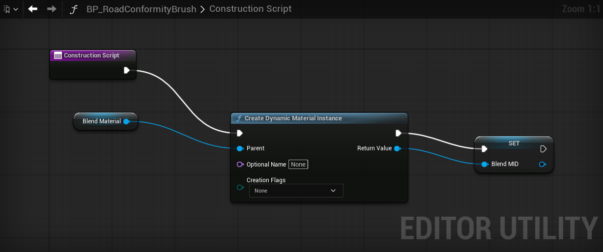
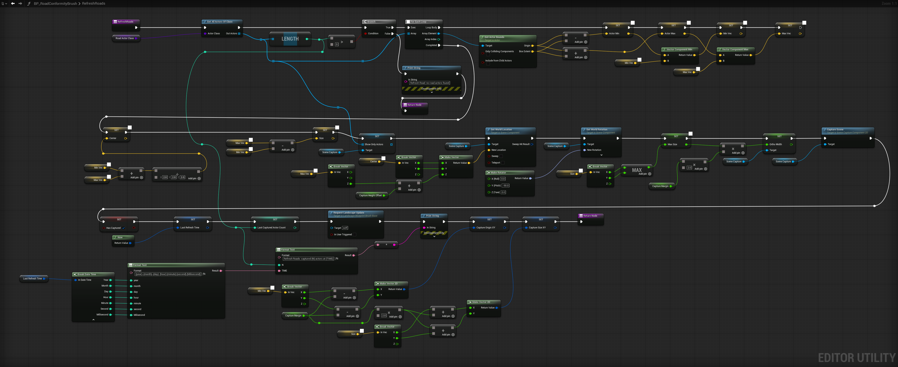
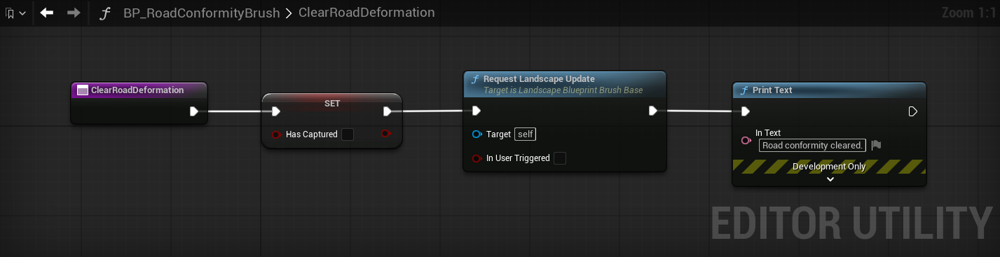
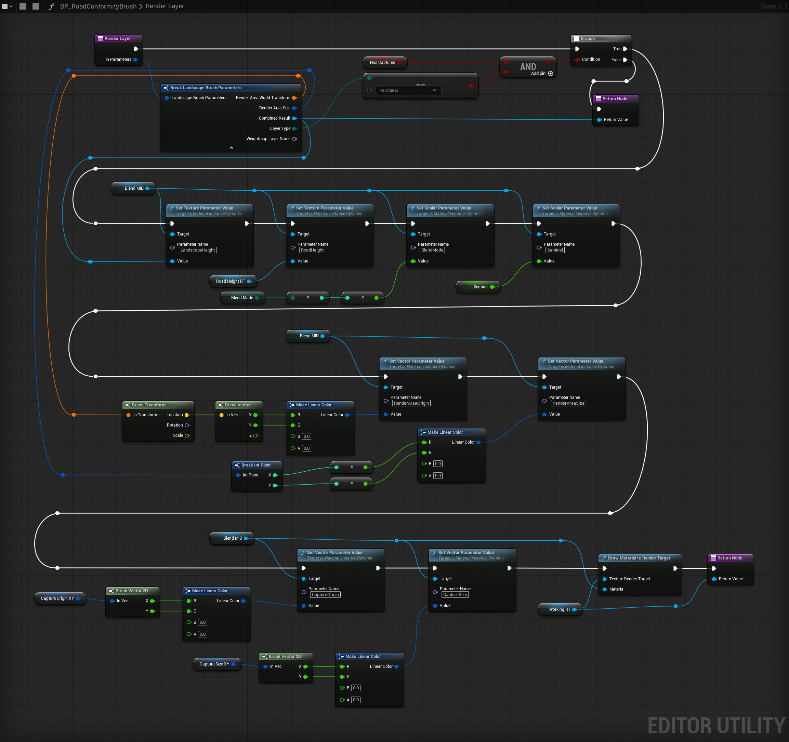

# TB — Road Conformity Landscape Brush

## Overview

Roads are authored by placing static meshes at heights sampled from the landscape under each spline point. When the landscape is later sculpted, or when roads are moved/replaced, the two drift out of alignment — terrain pokes through asphalt, gaps appear under bridge abutments, sidewalk seams float. This brief defines a procedural landscape modifier that pulls the terrain back into alignment with the current state of the road network, on demand.

The implementation is a Landscape Blueprint Brush that uses a Scene Capture 2D to read road mesh heights from the live scene, then blends those into a dedicated Landscape Edit Layer. It runs only on manual refresh, leaves all other landscape sculpting untouched, and naturally respects World Partition streaming — the brush only ever sees and writes to whatever's currently loaded.

This is the implementation of "Option C" from the design discussion that produced this brief. Earlier options considered: Landscape Splines (rejected — fights the spline system at the scale of a 16km road network) and a pre-baked heightmap PNG (rejected — 16k × 16k texture is unwieldy, and roads change too often for a bake to stay current).

---

## Architecture

```
RoadGeo actors in the level (subclass of WorldBLDGeo)
        │
        │ (top-down ortho render, show-only filtered to WorldBLDGeo)
        ▼
[SceneCaptureComponent2D]
        │
        │ (M_PP_EncodeWorldZ post-process material:
        │  encodes WorldPosition.Z as the pixel value, sentinel where no hit)
        ▼
[RT_RoadHeights] (R32F)   ← cached, only updated on Refresh Roads
        │
[BP_RoadConformityBrush.Render()]
        │ (M_LandscapeBrush_RoadConformity blend material:
        │  combines InCombinedResult with RT_RoadHeights per BlendMode)
        ▼
[Roads Edit Layer on the Landscape]
        │
        ▼
[Final landscape heights conform to road meshes]
```

The expensive step is the SceneCapture. It runs only when the user clicks **Refresh Roads** on the brush. Render() itself is a lightweight two-texture blend that can be called as often as the landscape system wants without noticeable cost.

---

## Pieces

| Asset | Type | Path | Purpose |
|---|---|---|---|
| `BP_RoadConformityBrush` | Blueprint Class (parent: `LandscapeBlueprintBrush`) | `Content/MGA/Blueprints/World/` | The brush itself. Hosts the SceneCapture, refresh logic, and Render() override. |
| `RT_RoadHeights` | Texture Render Target 2D, R32F | `Content/MGA/Materials/Shared/Brushes/` | Cached road heightmap. SceneCapture writes here; blend material reads here. |
| `RT_BrushWorking` | Texture Render Target 2D, R16F (or whatever the landscape brush stack expects) | `Content/MGA/Materials/Shared/Brushes/` | Per-call output of Render(). Re-used each call. |
| `M_PP_EncodeWorldZ` | Material, Post Process domain | `Content/MGA/Materials/Shared/Brushes/` | Used by the SceneCapture's post-process settings to encode world Z into the captured render target. |
| `MF_EncodeWorldZ` | Material Function | `Content/MGA/Materials/Functions/` | Optional helper shared between the encode material and the blend material. |
| `M_LandscapeBrush_RoadConformity` | Material, Surface domain (unlit, opaque) | `Content/MGA/Materials/Shared/Brushes/` | Blend material; combines current landscape height with road height per `BlendMode`. |

---

## Landscape configuration (one-time)

In UE 5.7, all landscapes use the edit-layer system by default — non-edit-layer landscapes are deprecated and the explicit "Enable Edit Layers" checkbox no longer exists. Edit Layers is simply on.

1. Open **Landscape Mode → Manage tab** and locate the **Edit Layers** panel (it's usually at or near the bottom of the Manage tab; can also be opened as a floating panel via Window menu).
2. Add an edit layer named `Roads`. Position it above your `Base` sculpting layer in the stack.
3. Add the brush to the layer (rather than dragging it into the viewport — that path no longer works for landscape brushes in 5.3+): select the `Roads` layer in the panel, then right-click the layer row → **Add Blueprint Brush** (or use the panel's **+ Brush** button) → pick `BP_RoadConformityBrush`. The actor gets placed in the world and registered against the layer in one step.

**Critical brush class property to set before any of this works:** in the brush BP's Class Defaults, ensure **`Affects Heightmap = true`**. The base class `LandscapeBlueprintBrushBase` defaults this to false, which makes the brush invisible to the heightmap layer picker. Without it ticked, the brush won't show up when you try to add it. Leave `Affects Weightmap` and `Affects Visibility Layer` off — this brush only modifies heights.

---

## Blueprint sketch — BP_RoadConformityBrush

### Variables

Column "Flags" lists Blueprint variable-details checkboxes: **IE** = Instance Editable (the BP equivalent of `EditAnywhere`, lets the variable be edited per-instance in the level's Details panel), **BPRO** = Blueprint Read Only (prevents Set nodes from being made for the variable in graphs that reference this BP).

| Name | Type | Default | Flags | Notes |
|---|---|---|---|---|
| `SceneCapture` | `SceneCaptureComponent2D` | — | — | Added as a component, not a variable; configured below |
| `RoadHeightsRT` | `TextureRenderTarget2D` | reference to `RT_RoadHeights` | IE | The cached heightmap |
| `WorkingRT` | `TextureRenderTarget2D` | reference to `RT_BrushWorking` | IE | Per-call output |
| `BlendMaterial` | `MaterialInterface` | reference to `M_LandscapeBrush_RoadConformity` | IE | |
| `RoadActorClass` | `TSubclassOf<Actor>` | `WorldBLDGeo` (or `RoadGeo`) | IE | Class filter for capture |
| `BlendMode` | enum (`Set`/`Min`/`Max`) | `Min` | IE | `Min` = only push terrain down to roads; `Set` = exact match; `Max` = only push terrain up |
| `Sentinel` | float | `-100000.0` | IE | Value written by the encode material where no road is hit |
| `CaptureMargin` | float (cm) | `5000.0` | IE | Extra padding around bounds for the SceneCapture extent |
| `CaptureHeightOffset` | float (cm) | `50000.0` | IE | How far above bounds.MaxZ the SceneCapture sits |
| `bHasCaptured` | bool | `false` | IE | True once Refresh has run; brush is no-op until then. Exposed so you can see/clear it from the Details panel during testing |
| `LastRefreshTime` | DateTime | — | IE | Set by `RefreshRoads`; shown in Details for sanity-check. (Leave BPRO off — `RefreshRoads` needs to Set it; user editing the field is harmless since the next refresh overwrites.) |
| `LastCapturedActorCount` | int | `0` | IE | Same pattern as `LastRefreshTime` |

### Class-default flags (Class Defaults panel)

These aren't variables you add — they're inherited properties from `LandscapeBlueprintBrushBase` that you set in the brush's **Class Defaults**:

| Flag | Default in base class | Set to | Why |
|---|---|---|---|
| `Affects Heightmap` | `false` | **`true`** | Required — without it the brush won't show in the heightmap layer's brush picker, and the symptom is "the brush flashes when I try to add it but doesn't actually attach to a layer" |
| `Affects Weightmap` | `false` | leave `false` | We don't modify paint layers |
| `Affects Visibility Layer` | `false` | leave `false` | We don't modify the visibility mask |

### Components

- `SceneCapture` (SceneCaptureComponent2D)
  - Projection Type: **Orthographic**
  - Capture Source: **Final Color (HDR) in Linear sRGB** (we want unbounded float output)
  - Texture Target: `RoadHeightsRT`
  - Show-Only Actors: populated at refresh time
  - Post Process Settings → Post Process Materials: `M_PP_EncodeWorldZ` (weight 1.0)
  - Capture every frame: **off**
  - Capture on movement: **off** (we trigger capture manually)

### Construction Script

The MID for the blend material is created once on construction and stored in a `BlendMID` instance variable so Render Layer can reuse it across calls instead of recreating per-call.



### Function: `RefreshRoads` (CallInEditor)

```
RefreshRoads():
    bounds = ComputeRoadBounds()              // see GetBounds below
    if bounds is empty:
        Print "No road actors found — nothing to refresh"
        return

    actors = GetAllActorsOfClass(RoadActorClass)
    SceneCapture.ShowOnlyActors = actors

    // Position the SceneCapture above the bounds, looking straight down
    captureCenterXY = bounds.Center
    captureZ        = bounds.MaxZ + CaptureHeightOffset
    SceneCapture.SetWorldLocation(Vector(captureCenterXY.X, captureCenterXY.Y, captureZ))
    SceneCapture.SetWorldRotation(Rotator(Pitch=-90, Yaw=0, Roll=0))
    SceneCapture.OrthoWidth = max(bounds.SizeX, bounds.SizeY) + 2 * CaptureMargin

    // Trigger the capture (this is the expensive call — single GPU pass over road actors)
    SceneCapture.CaptureScene()

    bHasCaptured           = true
    LastRefreshTime        = Now()
    LastCapturedActorCount = actors.Num()

    // Tell the landscape system that the Roads layer needs to re-render
    RequestLandscapeUpdate()                  // see "UE 5.7 API notes" below

    Print "Road conformity refreshed: captured {actors.Num()} actors at {LastRefreshTime}"
```

Reference graph (implemented):



Notes on the implementation:
- Top row builds the actor list and early-outs if empty.
- Middle row is the For Each Loop accumulating bounds (Vector Min / Vector Max on min and max corner vectors).
- After the loop: `Set Show Only Actors`, `Set World Location` and `Set World Rotation` on the SceneCapture, `Set Ortho Width`, then `Capture Scene`.
- Final row updates state variables (`bHasCaptured`, `LastRefreshTime`, `LastCapturedActorCount`), calls `Request Landscape Update`, and prints a confirmation.

### Function: `ClearRoadDeformation` (CallInEditor)

```
ClearRoadDeformation():
    bHasCaptured = false
    RequestLandscapeUpdate()
    Print "Road conformity cleared"
```

Reference graph (implemented):



### Override: `Render Layer`

In UE 5.7 the override is **`Render Layer`** (renamed from the older `Render` since edit layers are now mandatory). The function takes a single struct input — `In Parameters` of type `Landscape Brush Parameters`. Break the struct to access:

| Pin | Type | Used for |
|---|---|---|
| `Render Area World Transform` | Transform | Origin of the chunk being rendered (Break → Location → XY) — feeds blend material's `RenderAreaOrigin` |
| `Render Area Size` | Vector2D | Size of the chunk being rendered — feeds blend material's `RenderAreaSize` |
| `Combined Result` | Texture Render Target 2D | The input layer state — feeds blend material's `LandscapeHeight`; also passthrough value on the no-op path |
| `Layer Type` | enum | Filter — only act when this equals `Heightmap` |
| `Weightmap Layer Name` | Name | Unused (we never affect weightmaps) |

```
RenderLayer(InParameters) → TextureRenderTarget2D:
    Break InParameters → {RenderAreaWorldTransform, RenderAreaSize,
                          CombinedResult, LayerType, WeightmapLayerName}

    if not (bHasCaptured AND LayerType == Heightmap):
        return CombinedResult                 // no-op pass-through

    // Update parameters on the cached BlendMID (built in Construction Script)
    Set Texture Param: LandscapeHeight   = CombinedResult
    Set Texture Param: RoadHeight        = RoadHeightsRT
    Set Scalar  Param: BlendMode         = int(BlendMode)
    Set Scalar  Param: Sentinel          = Sentinel
    Set Vector  Param: RenderAreaOrigin  = LinearColor(RenderAreaWorldTransform.Location.X,
                                                       RenderAreaWorldTransform.Location.Y, 0, 0)
    Set Vector  Param: RenderAreaSize    = LinearColor(RenderAreaSize.X, RenderAreaSize.Y, 0, 0)
    Set Vector  Param: CaptureOrigin     = LinearColor(CaptureOriginXY.X, CaptureOriginXY.Y, 0, 0)
    Set Vector  Param: CaptureSize       = LinearColor(CaptureSizeXY.X,   CaptureSizeXY.Y,   0, 0)

    DrawMaterialToRenderTarget(Target = WorkingRT, Material = BlendMID)
    return WorkingRT
```

`Make Linear Color` is the BP-friendly way to pack a Vector2D (or a Vector3) into the 4-channel `LinearColor` that vector material parameters accept (R=X, G=Y, B=Z, A=unused). The blend material reads `.R` and `.G` to recover the X/Y values.

Reference graph (implemented):



Notes on the implementation:
- Top section breaks `In Parameters` and AND's `Has Captured` with the heightmap check. False branch returns `Combined Result` unchanged.
- True path is a long horizontal chain of `Set ... Parameter Value` calls on `BlendMID` — one each for the two textures, the two scalars, and the four vectors (RenderAreaOrigin, RenderAreaSize, CaptureOrigin, CaptureSize).
- The vector params are built by `Make Linear Color` nodes that pack the XY components into RGBA.
- Ends with `Draw Material To Render Target` (target = `WorkingRT`, material = `BlendMID`) → Return Node with `WorkingRT`.

### Override: `GetBounds`

```
GetBounds() → FBox:
    box = empty FBox
    actors = GetAllActorsOfClass(RoadActorClass)
    for actor in actors:
        box += actor.GetActorBounds(includeFromChildActors=true)
    if box is empty:
        return ParentLandscape.GetLoadedBounds()    // fallback so brush isn't degenerate
    return box
```

`GetBounds()` is what tells the landscape system *where* this brush can affect terrain. Recomputing from live actors means the brush footprint follows whatever's loaded — naturally World-Partition-friendly.

### UE 5.7 API notes

- **`Request Landscape Update`** is callable as a BP node directly on the brush (`self`) in 5.7 — no C++ helper required. Confirmed in the implemented graphs.
- `Draw Material To Render Target` is the Blueprint-friendly entry point; material parameters need to be set in advance on a Material Instance Dynamic (MID). The MID is created once in the Construction Script and stored in a `BlendMID` instance variable.
- `SceneCaptureComponent2D::CaptureScene` is synchronous — by the time it returns, `RoadHeightsRT` reflects the new capture.
- The Render override in 5.7 is **`Render Layer`** (not `Render`), and takes a single `Landscape Brush Parameters` struct rather than separate bool/RT/Name params.

---

## Material sketch — `M_PP_EncodeWorldZ`

Material Domain: **Post Process**.
Blendable Location: **Replacing the Tonemapper** (so the output isn't clamped to LDR).
Output Format: feeds into `RoadHeightsRT` which is **RTF_R32f** — single-channel 32-bit float.

Graph logic (pseudo-shader):

```
worldPos = AbsoluteWorldPosition       // built-in node, gives world XYZ of this pixel
sceneDepth = SceneDepth                 // built-in node

farThreshold = (camera at +Z, ortho) → anything beyond known max road Z is "sky"
isHit = sceneDepth < farThreshold

z = worldPos.B                          // .Z component
EmissiveColor = float3(
    isHit ? z : Sentinel,
    0,
    0
)
```

Only the R channel matters (the RT is single-channel). G and B are ignored.

---

## Material sketch — `M_LandscapeBrush_RoadConformity`

Material Domain: **Surface**.
Shading Model: **Unlit**.
Blend Mode: **Opaque**.

This is the material the brush calls in `Render()` to do the per-pixel blend. It samples two render targets and outputs the blended height to Emissive.

Material parameters:

| Param | Type | Notes |
|---|---|---|
| `LandscapeHeight` | Texture2D Object Parameter | bound to `InCombinedResult` |
| `RoadHeight` | Texture2D Object Parameter | bound to `RoadHeightsRT` |
| `BlendMode` | Scalar | 0=Set, 1=Min, 2=Max |
| `Sentinel` | Scalar | value indicating "no road at this pixel" |
| `BrushBoundsOrigin` / `BrushBoundsSize` | Vector2 | brush working region in world XY |
| `CaptureBoundsOrigin` / `CaptureBoundsSize` | Vector2 | scene capture's footprint in world XY |

Graph logic (pseudo-shader):

```
uvBrush = TexCoord[0]                              // 0..1 across brush working area
worldXY = BrushBoundsOrigin + uvBrush * BrushBoundsSize
uvCapture = (worldXY - CaptureBoundsOrigin) / CaptureBoundsSize

L = TextureSample(LandscapeHeight, uvBrush).R
R = TextureSample(RoadHeight, uvCapture).R

isRoad = R != Sentinel (with epsilon)
isInsideCapture = uvCapture.X in [0,1] and uvCapture.Y in [0,1]
valid = isRoad and isInsideCapture

result =
    valid == false ? L
    : BlendMode == 0 ? R              // Set
    : BlendMode == 1 ? min(L, R)      // Min
    :                  max(L, R)      // Max

EmissiveColor = float3(result, 0, 0)
```

The UV math accounts for the fact that the brush's working region and the SceneCapture's footprint don't have to be the same size. The brush operates over `bounds + margin`, the SceneCapture covers the same plus a configurable margin — usually they match, but keeping the UVs explicit makes the math robust to mismatch.

---

## World Partition behaviour

Roads and landscape both stream with WP. The brush inherits the right behaviour for free:

- `GetAllActorsOfClass(RoadActorClass)` returns only loaded actors. The SceneCapture's show-only list contains only the loaded set.
- `GetBounds()` computes from loaded actors only. The brush footprint shrinks to whatever's loaded.
- The landscape's Edit Layer system only writes to loaded landscape regions. Saved data lives per region.

Workflow: load a region, click Refresh Roads, save. Repeat per region. Regions don't need to be loaded simultaneously.

**Boundary gotcha.** If a long road segment is anchored to region A but its mesh extends into B:
- With **A loaded, B not loaded**: the brush captures the full mesh but only writes to A's terrain; B's terrain stays unmodified for now.
- With **B loaded, A not loaded**: the actor isn't in the world (it's anchored to A), the SceneCapture doesn't see it, B's terrain near the seam is unconformed.

Mitigations:
1. **Preferred**: ensure each road segment is its own actor anchored to the cell it primarily occupies. Long L3 segments crossing multiple cells should be split per cell, not authored as one long actor.
2. **Per-session fallback**: before clicking Refresh near a region boundary, manually load adjacent cells through the World Partition window so the brush has the full neighbourhood in view.

---

## Workflow

1. Open the level. Roads layer is empty (or holds its last-saved state if you've refreshed before).
2. Place, move, or delete `RoadGeo` actors freely. Landscape is untouched during editing.
3. When you want to see conformity, select `BP_RoadConformityBrush` → **Refresh Roads** in the Details panel.
4. SceneCapture runs once, blend draws once, terrain conforms.
5. If you change roads further and want the terrain to follow, click Refresh again.
6. If you want the Roads layer cleared (e.g. to sculpt under a road without flicker), click **Clear Road Deformation**.

`LastRefreshTime` and `LastCapturedActorCount` in the brush's Details show what the last refresh did — useful sanity check.

---

## Open items / gotchas

- **Class hierarchy assumption.** `RoadGeo` inherits from `WorldBLDGeo`. The brush filters by `WorldBLDGeo` by default to catch all world-building geometry — narrow to `RoadGeo` if you don't want other `WorldBLDGeo` subclasses (buildings, props) to deform terrain. Configurable via the `RoadActorClass` variable.
- **RT_RoadHeights resolution.** Default to 4096×4096 for a working region up to ~8km — that's ~2m/pixel, fine for road-width features. Bump to 8192×8192 if you're working a larger region or need finer alignment around intersections. Pixel cost is one-time at refresh.
- **Float RT format.** `RT_RoadHeights` must be `RTF_R32f` for the Z value to round-trip cleanly. If the engine doesn't let you select that in the editor RT properties, set the texture group / Pixel Format manually after creation.
- **Visibility at refresh time.** `SceneCapture` only sees renderable actors. Hidden RoadGeo actors won't contribute. Before refresh, the brush could iterate WorldBLDGeo actors, force-show them, capture, then restore original visibility — flagging here in case it becomes a real annoyance.
- ~~**`RequestLandscapeUpdate` exact name.**~~ Resolved: in 5.7 the function is `Request Landscape Update`, BP-callable on the brush itself. No fallback needed.
- **Capture happens against the editor view's framerate.** A single capture is fast (~ms) but if Refresh is called rapidly or scripted in a loop, throttle it.

---

## Related

- [TB-landscape-river-pipeline](TB-landscape-river-pipeline.md) — sibling landscape-modification pipeline (Gaea import → river survey → spline normalize → water actors)
- [TB-content-directory](TB-content-directory.md) — asset path conventions for the new BP and materials
- [TB-materials](TB-materials.md) — master materials and naming patterns; the brush's materials follow the same `M_*` / `MF_*` conventions
- [terridyn-roads](../../mgaPriv/world/terridyn-roads.md) — road tier ROWs (L1=18m, L2=30m, L3=40m) that determine SceneCapture margin requirements
- `mga/reference/generate_city_grid.py` — generator that produces road centerlines; useful for understanding where road actors come from in the first place
